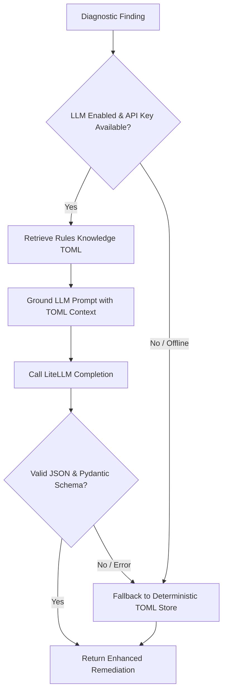

# AI Critic & Remediation System

The **AI Critic Agent** (`AICriticAgent`) enhances diagnostic findings generated by Workflow Clinic rules with structured, context-aware remediation advice.

---

## 🤖 Overview

When `workflow-clinic examine` analyzes a bioinformatics workflow, static rules flag issues such as unpinned container tags or missing resource limits. The AI Critic enriches each finding with a structured `Remediation` model containing:

1. **`summary`**: A concise 1-sentence action summary.
2. **`explanation`**: A detailed rationale explaining why the fix is necessary for cloud readiness and portability.
3. **`code_example`**: An optional code snippet demonstrating the target fix.

---

## 🔑 BYOK & BYOM Support

Powered by **LiteLLM**, the AI Critic supports:

- **BYOK (Bring Your Own Key)**: Pass explicit API keys or use standard provider environment variables (`OPENAI_API_KEY`, `GEMINI_API_KEY`, `ANTHROPIC_API_KEY`, `MISTRAL_API_KEY`, `COHERE_API_KEY`, `GROQ_API_KEY`).
- **BYOM (Bring Your Own Model)**: Configure any supported LiteLLM model string (e.g. `gemini/gemini-3.6-flash`, `gpt-4o`, `anthropic/claude-3-5-sonnet`, or local models via `ollama/llama3`).

```python
from workflow_clinic.critic import AICriticAgent

# Bring Your Own Key & Model
agent = AICriticAgent(
    model_name="gemini/gemini-3.6-flash",
    api_key="your-api-key-here",
)
```

---

## ⚡ Grounded RAG & Offline TOML Fallback

To prevent LLM hallucinations and support air-gapped or CI/CD environments, the AI Critic uses a multi-tier fallback architecture:



1. **Grounded Prompting**: The LLM prompt is grounded with curated best-practice guidelines from `rules_knowledge.toml`.
2. **Deterministic Fallback**: If LLM API keys are unconfigured, network requests time out, or malformed JSON is returned, the agent automatically falls back to generating remediations directly from the deterministic local TOML Knowledge Store.

---

## 🎯 Correctness & Reproducibility

To ensure reliability across model executions:

- **Grounded Context Injection**: Prompts are strictly grounded using verified rules knowledge retrieved directly from `rules_knowledge.toml`.
- **Low Sampling Temperature**: LiteLLM completion calls enforce `temperature=0.2` to minimize output variance.
- **Pydantic Guardrails & Fallback**: Outputs are validated against the `Remediation` schema. If a model generates invalid JSON or malformed content, it immediately triggers the deterministic fallback path.
- **Deterministic CI Mode**: Running with `enable_llm=False` guarantees 100% bit-for-bit reproducible outputs without external network dependencies.

