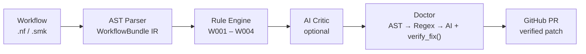
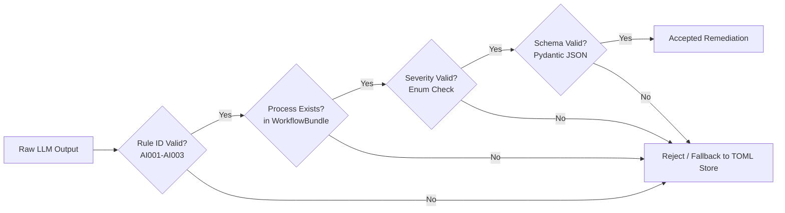

# **Final Report GSoC 2026: Workflow Clinic**

<div style="display: flex; align-items: center; justify-content: center; gap: 40px; margin: 25px 0 35px 0; flex-wrap: wrap;">
  
  
  
</div>

This is the final report for my project that I have built during **Google Summer of Code 2026** under the **Global Alliance for Genomics and Health (GA4GH)** and **ELIXIR**, mentored by **Alex Kanitz** and **Javed Habib**.

## **Project Details**

- **Student:** [Revaa Rathore](https://linkedin.com/in/revaarathore) ([GitHub](https://github.com/revaarathore11))
- **Mentors:** [Alex Kanitz](https://github.com/uniqueg), [Javed Habib](https://github.com/JaeAeich)
- **Organization:** [GA4GH](https://www.ga4gh.org/) · [ELIXIR](https://elixir-europe.org/)
- **Repository:** [ga4gh/ga4gh_workflow_clinic_gsoc_2026](https://github.com/ga4gh/ga4gh_workflow_clinic_gsoc_2026)

---

!!! abstract "In Brief"
    Over 14 weeks, I built **Workflow Clinic** from scratch: an open-source static analysis and automated remediation engine that diagnoses and repairs scientific workflows for cloud readiness. **40+ merged PRs · 240+ unit and integration tests · 0 mypy type errors.**

---

## **By the Numbers**

<div style="display: grid; grid-template-columns: repeat(6, 1fr); gap: 8px; margin: 15px 0;">
  <div style="padding: 10px 4px; border: 1px solid var(--md-default-fg-color--lightest); border-radius: 6px; text-align: center; background: rgba(0,0,0,0.06);">
    <div style="font-size: 1.35rem; font-weight: 700; color: var(--md-primary-fg-color); line-height: 1.2;">40+</div>
    <div style="font-size: 0.72rem; opacity: 0.85; margin-top: 2px; white-space: nowrap;">Merged PRs</div>
  </div>
  <div style="padding: 10px 4px; border: 1px solid var(--md-default-fg-color--lightest); border-radius: 6px; text-align: center; background: rgba(0,0,0,0.06);">
    <div style="font-size: 1.35rem; font-weight: 700; color: var(--md-primary-fg-color); line-height: 1.2;">240+</div>
    <div style="font-size: 0.72rem; opacity: 0.85; margin-top: 2px; white-space: nowrap;">Unit Tests</div>
  </div>
  <div style="padding: 10px 4px; border: 1px solid var(--md-default-fg-color--lightest); border-radius: 6px; text-align: center; background: rgba(0,0,0,0.06);">
    <div style="font-size: 1.35rem; font-weight: 700; color: var(--md-primary-fg-color); line-height: 1.2;">3</div>
    <div style="font-size: 0.72rem; opacity: 0.85; margin-top: 2px; white-space: nowrap;">Fixer Layers</div>
  </div>
  <div style="padding: 10px 4px; border: 1px solid var(--md-default-fg-color--lightest); border-radius: 6px; text-align: center; background: rgba(0,0,0,0.06);">
    <div style="font-size: 1.35rem; font-weight: 700; color: var(--md-primary-fg-color); line-height: 1.2;">4</div>
    <div style="font-size: 0.72rem; opacity: 0.85; margin-top: 2px; white-space: nowrap;">Static Rules</div>
  </div>
  <div style="padding: 10px 4px; border: 1px solid var(--md-default-fg-color--lightest); border-radius: 6px; text-align: center; background: rgba(0,0,0,0.06);">
    <div style="font-size: 1.35rem; font-weight: 700; color: var(--md-primary-fg-color); line-height: 1.2;">3</div>
    <div style="font-size: 0.72rem; opacity: 0.85; margin-top: 2px; white-space: nowrap;">AI Rules</div>
  </div>
  <div style="padding: 10px 4px; border: 1px solid var(--md-default-fg-color--lightest); border-radius: 6px; text-align: center; background: rgba(0,0,0,0.06);">
    <div style="font-size: 1.35rem; font-weight: 700; color: var(--md-primary-fg-color); line-height: 1.2;">0</div>
    <div style="font-size: 0.72rem; opacity: 0.85; margin-top: 2px; white-space: nowrap;">mypy Errors</div>
  </div>
</div>

---

## **Who I Am**

I am **Revaa Rathore**, a Computer Science undergraduate specializing in Artificial Intelligence and Machine Learning at Polaris School of Technology, Bengaluru.

Before GSoC, my background was centered on full-stack web engineering. Workflow Clinic pushed me directly into compiler theory, Abstract Syntax Tree (AST) parsing, bioinformatics workflow modeling, deterministic static analysis, and grounded LLM orchestration, none of which was my comfort zone in May 2026.

My mentors, **Alex Kanitz** and **Javed Habib**, shaped this project more than any isolated technical decision I made. Their consistent guidance was clear: *prefer correctness over cleverness, test against real-world production pipelines rather than synthetic fixtures, and ship small, reviewable units with tests and documentation included.*

---

## **What I Built: End to End**

Modern life sciences research depends on computational genomics workflows processing gigabytes to terabytes of sequencing data across heterogeneous clusters ([Wratten et al., *Nature Methods* 2021](https://doi.org/10.1038/s41592-021-01254-9)). The **Global Alliance for Genomics and Health (GA4GH)** establishes international standards for genomic data sharing ([Rehm et al., *Cell Genomics* 2021](https://doi.org/10.1016/j.xgen.2021.100029)) and cloud computing interoperability via the [GA4GH](https://www.ga4gh.org/) Federated Analysis ecosystem, including the [Workflow Execution Service (WES)](https://www.ga4gh.org/product/workflow-execution-service-wes/) and [Task Execution Service (TES)](https://www.ga4gh.org/product/task-execution-service-tes/) specifications.

Scientific pipelines written in workflow management systems such as **Nextflow** ([Di Tommaso et al., *Nature Biotechnology* 2017](https://doi.org/10.1038/nbt.3820)) and **Snakemake** ([Mölder et al., *F1000Research* 2021](https://doi.org/10.12688/f1000research.29032.2)) frequently run into portability blockers when migrating from local servers to cloud environments (AWS Batch, Google Cloud, Kubernetes, GA4GH WES/TES). Common failures include unpinned container images (`W001`), missing CPU/memory limits (`W002`), hardcoded absolute paths (`W003`), or leaked secrets (`W004`).

**Workflow Clinic** solves this by automating both the diagnosis and remediation stages through a single unified pipeline:



*For detailed reference guides on individual subsystems, see the [Architecture](architecture/architecture.md), [AI Critic](ai_critic.md), [Workflow Doctor](doctor.md), and [Issue Generation](issue_generation.md) documentation.*

---

## **How It Evolved: 9 Milestones**

| Phase | Milestone | Focus Areas | Key Pull Requests |
| :--- | :--- | :--- | :--- |
| **Phase 1** | **M1: Parser Architecture** | Lark AST, `BaseParser`, `WorkflowBundle`, line tracking | [#41](https://github.com/ga4gh/ga4gh_workflow_clinic_gsoc_2026/pull/41), [#42](https://github.com/ga4gh/ga4gh_workflow_clinic_gsoc_2026/pull/42), [#53](https://github.com/ga4gh/ga4gh_workflow_clinic_gsoc_2026/pull/53), [#65](https://github.com/ga4gh/ga4gh_workflow_clinic_gsoc_2026/pull/65), [#71](https://github.com/ga4gh/ga4gh_workflow_clinic_gsoc_2026/pull/71), [#73](https://github.com/ga4gh/ga4gh_workflow_clinic_gsoc_2026/pull/73) |
| **Phase 1** | **M2: Static Rule Engine** | Offline `W001`-`W004` checks (<5ms per file) | [#43](https://github.com/ga4gh/ga4gh_workflow_clinic_gsoc_2026/pull/43), [#56](https://github.com/ga4gh/ga4gh_workflow_clinic_gsoc_2026/pull/56), [#57](https://github.com/ga4gh/ga4gh_workflow_clinic_gsoc_2026/pull/57), [#75](https://github.com/ga4gh/ga4gh_workflow_clinic_gsoc_2026/pull/75) |
| **Phase 1** | **M3: Fingerprinting** | SHA-256 issue & PR deduplication tags | [#75](https://github.com/ga4gh/ga4gh_workflow_clinic_gsoc_2026/pull/75), [#79](https://github.com/ga4gh/ga4gh_workflow_clinic_gsoc_2026/pull/79) |
| **Phase 1** | **M4: AI Critic & RAG** | LiteLLM, `rules_knowledge.toml`, anti-hallucination | [#45](https://github.com/ga4gh/ga4gh_workflow_clinic_gsoc_2026/pull/45), [#52](https://github.com/ga4gh/ga4gh_workflow_clinic_gsoc_2026/pull/52), [#77](https://github.com/ga4gh/ga4gh_workflow_clinic_gsoc_2026/pull/77), [#91](https://github.com/ga4gh/ga4gh_workflow_clinic_gsoc_2026/pull/91), [#94](https://github.com/ga4gh/ga4gh_workflow_clinic_gsoc_2026/pull/94) |
| **Phase 1** | **M5: CLI & Publishing** | `examine`, `create-issue`, interactive Rich selector | [#51](https://github.com/ga4gh/ga4gh_workflow_clinic_gsoc_2026/pull/51), [#66](https://github.com/ga4gh/ga4gh_workflow_clinic_gsoc_2026/pull/66), [#67](https://github.com/ga4gh/ga4gh_workflow_clinic_gsoc_2026/pull/67), [#68](https://github.com/ga4gh/ga4gh_workflow_clinic_gsoc_2026/pull/68), [#81](https://github.com/ga4gh/ga4gh_workflow_clinic_gsoc_2026/pull/81), [#82](https://github.com/ga4gh/ga4gh_workflow_clinic_gsoc_2026/pull/82) |
| **Phase 2** | **M6: Doctor Architecture** | 3-layer fixer cascade, `FixSession` audit trail | [#95](https://github.com/ga4gh/ga4gh_workflow_clinic_gsoc_2026/pull/95) |
| **Phase 2** | **M7: Layer 1 AST Fixers** | AST directive patcher, bottom-up line ordering | [#96](https://github.com/ga4gh/ga4gh_workflow_clinic_gsoc_2026/pull/96) |
| **Phase 2** | **M8: Layer 2 & 3 Fixers** | Path/Secret regex parameterization, AI refactoring | [#99](https://github.com/ga4gh/ga4gh_workflow_clinic_gsoc_2026/pull/99), [#101](https://github.com/ga4gh/ga4gh_workflow_clinic_gsoc_2026/pull/101) |
| **Phase 2** | **M9: GitHub PR Publishing** | Automated remote branches, atomic commits, PR body | [#103](https://github.com/ga4gh/ga4gh_workflow_clinic_gsoc_2026/pull/103) |

---

## **Phase 1: Diagnostic & Critic Engine**

### **Milestone 1 · Parser Architecture** ([PR #41](https://github.com/ga4gh/ga4gh_workflow_clinic_gsoc_2026/pull/41), [PR #42](https://github.com/ga4gh/ga4gh_workflow_clinic_gsoc_2026/pull/42), [PR #53](https://github.com/ga4gh/ga4gh_workflow_clinic_gsoc_2026/pull/53), [PR #65](https://github.com/ga4gh/ga4gh_workflow_clinic_gsoc_2026/pull/65), [PR #71](https://github.com/ga4gh/ga4gh_workflow_clinic_gsoc_2026/pull/71), [PR #73](https://github.com/ga4gh/ga4gh_workflow_clinic_gsoc_2026/pull/73))
Built the AST ingestion engine using `groovy-parser` (Lark grammar), `BaseParser`, `ParserRegistry`, and the language-agnostic `WorkflowBundle` intermediate model with hybrid line tracking.

### **Milestone 2 · Deterministic Rule Engine** ([PR #43](https://github.com/ga4gh/ga4gh_workflow_clinic_gsoc_2026/pull/43), [PR #56](https://github.com/ga4gh/ga4gh_workflow_clinic_gsoc_2026/pull/56), [PR #57](https://github.com/ga4gh/ga4gh_workflow_clinic_gsoc_2026/pull/57), [PR #75](https://github.com/ga4gh/ga4gh_workflow_clinic_gsoc_2026/pull/75))
Implemented offline static analysis rules `W001`-`W004` (containers, compute resources, hardcoded paths, and leaked credentials) executing in under 5ms per file.

### **Milestone 3 · SHA-256 Structural Fingerprinting** ([PR #75](https://github.com/ga4gh/ga4gh_workflow_clinic_gsoc_2026/pull/75), [PR #79](https://github.com/ga4gh/ga4gh_workflow_clinic_gsoc_2026/pull/79))
Designed deterministic SHA-256 structural hashing embedded as invisible HTML comment tags in GitHub issues and PRs to prevent duplicate reporting across runs.

### **Milestone 4 · AI Critic & Grounded Knowledge Store** ([PR #45](https://github.com/ga4gh/ga4gh_workflow_clinic_gsoc_2026/pull/45), [PR #52](https://github.com/ga4gh/ga4gh_workflow_clinic_gsoc_2026/pull/52), [PR #77](https://github.com/ga4gh/ga4gh_workflow_clinic_gsoc_2026/pull/77), [PR #91](https://github.com/ga4gh/ga4gh_workflow_clinic_gsoc_2026/pull/91), [PR #94](https://github.com/ga4gh/ga4gh_workflow_clinic_gsoc_2026/pull/94))
Integrated `LiteLLM` contextual auditing grounded by local `rules_knowledge.toml` with strict anti-hallucination validation and offline fallback.

### **Milestone 5 · CLI Commands & Real-World Validation** ([PR #51](https://github.com/ga4gh/ga4gh_workflow_clinic_gsoc_2026/pull/51), [PR #66](https://github.com/ga4gh/ga4gh_workflow_clinic_gsoc_2026/pull/66), [PR #67](https://github.com/ga4gh/ga4gh_workflow_clinic_gsoc_2026/pull/67), [PR #68](https://github.com/ga4gh/ga4gh_workflow_clinic_gsoc_2026/pull/68), [PR #81](https://github.com/ga4gh/ga4gh_workflow_clinic_gsoc_2026/pull/81), [PR #82](https://github.com/ga4gh/ga4gh_workflow_clinic_gsoc_2026/pull/82))
Delivered `workflow-clinic examine` and `workflow-clinic create-issue` with Rich terminal formatting, interactive category filtering, and live PyGitHub issue publishing.

---

## **Phase 2: Workflow Doctor Remediation Engine**

### **Milestone 6 · Doctor Core Architecture** ([PR #95](https://github.com/ga4gh/ga4gh_workflow_clinic_gsoc_2026/pull/95))
Architected the multi-tier remediation engine (`BaseFixer`, `FixerRegistry`, `DoctorRunner`, `FixSession`) with `verify_fix()` AST compilation verification and automatic rollback.

### **Milestone 7 · Layer 1 AST Fixers** ([PR #96](https://github.com/ga4gh/ga4gh_workflow_clinic_gsoc_2026/pull/96))
Created `ContainerASTFixer`, `ResourceASTFixer`, and `patcher.py` with bottom-up proposal ordering to inject directives cleanly without invalidating line offsets.

### **Milestone 8 · Layer 2 & Layer 3 Fixers** ([PR #99](https://github.com/ga4gh/ga4gh_workflow_clinic_gsoc_2026/pull/99), [PR #101](https://github.com/ga4gh/ga4gh_workflow_clinic_gsoc_2026/pull/101))
Implemented scoped regex parameterization (`PathRegexFixer`, `CredentialRegexFixer`) and context-aware LLM refactoring (`AIFixer`).

### **Milestone 9 · Automated GitHub PR Publishing** ([PR #103](https://github.com/ga4gh/ga4gh_workflow_clinic_gsoc_2026/pull/103))
Built zero-local-git automated PR publishing via PyGitHub: creates remote branches, commits modified files atomically, and opens PRs with diff tables and `Closes #N` issue linking.

---

## **Three Decisions That Defined the Architecture**

### **1. Regex to AST Parsing**
My first PR parsed Nextflow with regular expressions. Alex's feedback was direct: *"You will never see the end of edge cases."* Real Nextflow DSL2 has multi-line bash scripts, nested closures, and heredocs that break naive pattern matchers. Transitioning to `groovy-parser` (a Lark-based AST engine) with hybrid line tracking became the rock-solid foundation everything else built upon.

### **2. LangChain to LiteLLM & Local TOML Knowledge Store**
The initial project proposal suggested LangChain and ChromaDB. In practice, LangChain added heavy dependency overhead, and exact rule IDs (`W001`, `AI001`) did not need approximate vector similarity. A single-pass **LiteLLM** call grounded by a local `rules_knowledge.toml` store proved significantly faster, fully offline-capable, and simple to test.

### **3. Single-Pass Rewriter to 3-Layer Doctor Cascade**
Different issues require different safety guarantees:
- **Layer 1 (AST)**: Inserts missing `container` or `cpus` directives with structural compiler precision.
- **Layer 2 (Regex)**: Scopes path replacements inside opaque bash blocks (`params.input_file`).
- **Layer 3 (AI)**: Handles complex multi-line refactoring via LLM.

Every patch passes through `verify_fix()` AST compilation checks, auto-reverting immediately if syntax errors occur.

---

## **How We Keep AI Honest**

To ensure that LLM non-determinism never corrupts scientific pipelines, Workflow Clinic enforces strict validation guardrails before any AI-generated finding or patch enters the system:



> **Core Principle**: *The LLM does not get to define reality. The parsed workflow AST does.*

---

## **The Doctor in Action: Interactive Before and After**

=== "1. Raw Source Code (Before)"

    ```groovy
    // main.nf - Un-containerized process with hardcoded paths and missing limits
    process FASTQC {
        input:
        path reads

        script:
        """
        fastqc /home/user/data/input.fastq --threads 4
        """
    }
    ```

=== "2. Diagnostic Findings (diagnosis.json)"

    ```json
    {
      "workflow_name": "qc_pipeline",
      "findings_count": 3,
      "findings": [
        {
          "rule_id": "W001",
          "severity": "ERROR",
          "message": "Process 'FASTQC' has no container directive declared.",
          "line_number": 2
        },
        {
          "rule_id": "W002",
          "severity": "WARNING",
          "message": "Process 'FASTQC' lacks declared CPU and memory limits.",
          "line_number": 2
        },
        {
          "rule_id": "W003",
          "severity": "WARNING",
          "message": "Hardcoded absolute path detected: '/home/user/data/input.fastq'.",
          "line_number": 7
        }
      ]
    }
    ```

=== "3. Remediated Code (After)"

    ```groovy
    // main.nf - Fully cloud-ready and reproducible
    process FASTQC {
        container 'quay.io/biocontainers/fastqc:0.11.9' // TODO: Verify container image tag
        cpus 2
        memory '4 GB'

        input:
        path reads

        script:
        """
        fastqc ${params.input_fastq} --threads 4
        """
    }
    ```

---

## **What Real Workflows Taught Me**

Running Workflow Clinic against **`nf-core/fetchngs`** (a widely-used production pipeline downloaded thousands of times) detected **1 error and 28 warnings** across processes like `SRATOOLS_FASTERQDUMP` and `MULTIQC`.

```bash
$ workflow-clinic examine https://github.com/nf-core/fetchngs
Scanning workflow at 'fetchngs'...
✓ Saved diagnosis report to diagnosis.json
Summary: 1 error(s), 28 warning(s), 0 info(s)
```

Production pipelines exposed patterns that synthetic test fixtures never exercised:
- **Dynamic Configuration Closures**: Real pipelines use `cpus = { check_max( 2 * task.attempt, 'cpus' ) }` rather than plain integers.
- **Multi-File Modular Ingestion**: Sub-workflows span dozens of files across `modules/local/` and `modules/nf-core/`.

!!! tip "The Core Lesson"
    Synthetic fixtures validate your assumptions. Production workflows reveal what your assumptions missed.

---

## **Engineering with AI: A Transparency Note & Reflection**

Building Workflow Clinic coincided with a generational transition in how software is developed. As an AI/ML undergraduate working on an open-source tool with grounded AI capabilities, I actively integrated generative AI tooling throughout my daily development workflow.

### **The Evolution of My AI Practice**
In May 2026, my use of AI looked like that of many programmers: asking chat models for isolated code snippets, function syntax, and quick explanations. Over 14 weeks of mentor feedback and 40+ merged pull requests, my approach fundamentally shifted from **naive code generation** to **disciplined pair-engineering and architecture validation**:

1. **Test-Driven Scaffolding:** I used AI to rapidly generate comprehensive test edge cases (e.g. nested closures, unusual Nextflow directive combinations, and malformed Groovy heredocs), which allowed me to test corner cases far faster than writing boilerplate by hand.
2. **Grammar & AST Exploration:** When building Lark grammar rules for `groovy-parser`, AI assisted in exploring BNF productions, token ambiguities, and Lark tree transformations.
3. **Drafting & Copyediting:** AI served as a rapid technical copyeditor for drafting descriptive commit messages, comprehensive PR walkthroughs, and MkDocs documentation tables.

### **Where AI Fails: The Need for Deterministic Bounding**
The most crucial technical lesson I learned is that **probabilistic language models cannot be trusted with correctness in isolation**. Left unchecked, LLMs frequently hallucinated non-existent Nextflow directives, corrupted Groovy block scopes, and produced syntactically plausible but broken code.

This realization directly informed the design of Workflow Clinic itself:
- We never let the LLM invent rule IDs; it is grounded strictly against `rules_knowledge.toml`.
- We never let the LLM modify workflow code without running `verify_fix()` AST compilation checks immediately afterward.
- We require Layer 1 and Layer 2 deterministic fixers to execute before falling back to Layer 3 AI remediation.

### **Advice for Aspiring Programmers**
> **Treat AI output as untrusted user input.**  
> Use generative AI aggressively for exploration, brainstorming alternative patterns, and scaffolding tests. But let static analyzers, strict type systems (`mypy`), compiler parsers (`Lark`/AST), and automated CI test suites be the ultimate arbiters of truth.

---

## **Working in Open Source & Mentorship Lessons**

The most valuable skill I developed was understanding that the technical dialogue around code matters as much as the code itself. Every pull request needed to articulate not just *what* changed, but *why*, what alternatives were considered, and what trade-offs were made.

Alex's core principle, *"you add a feature, you add the docs and tests right along with it,"* produced a project where architecture, 240+ unit tests, and documentation stayed in sync across 40+ pull requests.

---

## **Before GSoC vs. After GSoC**

| Dimension | Before GSoC 2026 | After GSoC 2026 |
| :--- | :--- | :--- |
| **Domain Focus** | Full-stack web applications | Scientific workflow infrastructure & bioinformatics tooling |
| **Code Analysis** | String operations and regex | Abstract Syntax Tree (AST) parsing and static analysis |
| **System Philosophy** | Purely deterministic or prompt-based | Hybrid: deterministic foundations with bounded AI assistance |
| **Testing Approach** | Basic unit tests | Multi-tier test suites (synthetic, regression, and production fixtures) |
| **Architecture Mindset** | Feature-driven implementation | Extensible interfaces, modular cascades, and failure-tolerant design |
| **Collaboration** | Solo or small team development | Open-source governance, structured code review, and atomic PRs |

---

## **Final Reflection**

I started this summer knowing how to build web applications. I finished it knowing how to design pluggable parser architectures, write deterministic static analysis rules, orchestrate grounded AI repair pipelines, and navigate open-source scientific software governance.

Workflow Clinic is honest in a specific way: deterministic rules do exactly what they say, the AI layer validates its own output before anything is persisted, and the Doctor only commits changes it can syntactically verify and safely revert. That combination of correctness and humility about AI uncertainty is what I will carry forward most clearly.

I am deeply grateful to my mentors, **Alex Kanitz** and **Javed Habib**, and the **GA4GH and ELIXIR communities** for their mentorship and support throughout GSoC 2026.

---

**Revaa Rathore**  
*Google Summer of Code 2026 Contributor*  
*Global Alliance for Genomics and Health (GA4GH)*  

[GitHub](https://github.com/revaarathore11){ .md-button }
[LinkedIn](https://linkedin.com/in/revaarathore){ .md-button }
[Email](mailto:rathorerevaa2007@gmail.com){ .md-button }
